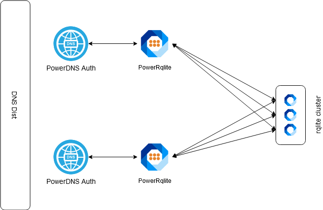

*PowerRqlite* is a small [PowerDNS Authoritative](https://powerdns.com) backend which allows to use a [rqlite](https://github.com/rqlite/rqlite) cluster as database / storage.


## How it works

*PowerRqlite* implements the required PowerDNS [remote backend functions](https://doc.powerdns.com/authoritative/backends/remote.html) and stores the data in the rqlite cluster using the [rqlite Data API](https://github.com/rqlite/rqlite/blob/master/DOC/DATA_API.md).

A simple deployment could be look like this:


*PowerRqlite* can be also be used to build a High Availbility setup **without** need for (complex) HA Backend MariaDB Galera Cluster.



## Prerequisites

* .NET Core 3.1 compatible Operating System (Ubuntu/Debian/CentOS/Alpine Linux/Windows/macOS) or a Docker Host
* [rqlite Cluster](https://github.com/rqlite/rqlite/blob/master/DOC/CLUSTER_MGMT.md)
* PowerDNS Authoritative 4.3.x or higher

*PowerRqlite* can be used for the following DNS Modes of Operation:

| Name        | Native | Master | Slave | SuperSlave | DNSSEC | Launch |
|-------------|:------:|:------:|:-----:|:----------:|:------:|:------:|
| PowerRqlite |   yes  |   yes  |   no  |     no     |   no   | remote |


## Known Issues

* Domains can not be created via pdnsutil. This have to be done via sql.
  ```
  INSERT INTO domains (name,master,last_check,type,notified_serial,account) VALUES('example.com','',NULL,'NATIVE',NULL,'');
  ```

## Quick Start

### rqlite

Grab the latest release from the rqlite [Github release page](https://github.com/rqlite/rqlite/releases). Once installed you can start a single rqlite node:

```
rqlited -node-id 1 ~/node.1
```

Once running we have to create the needed sql schema:

```
PRAGMA foreign_keys=OFF;
BEGIN TRANSACTION;
CREATE TABLE domains (
  id                    INTEGER PRIMARY KEY,
  name                  VARCHAR(255) NOT NULL COLLATE NOCASE,
  master                VARCHAR(128) DEFAULT NULL,
  last_check            INTEGER DEFAULT NULL,
  type                  VARCHAR(6) NOT NULL,
  notified_serial       INTEGER DEFAULT NULL,
  account               VARCHAR(40) DEFAULT NULL
);
CREATE TABLE records (
  id                    INTEGER PRIMARY KEY,
  domain_id             INTEGER DEFAULT NULL,
  name                  VARCHAR(255) DEFAULT NULL,
  type                  VARCHAR(10) DEFAULT NULL,
  content               VARCHAR(65535) DEFAULT NULL,
  ttl                   INTEGER DEFAULT NULL,
  disabled              BOOLEAN DEFAULT 0,
  ordername             VARCHAR(255),
  auth                  BOOL DEFAULT 1,
  FOREIGN KEY(domain_id) REFERENCES domains(id) ON DELETE CASCADE ON UPDATE CASCADE
);
CREATE TABLE supermasters (
  ip                    VARCHAR(64) NOT NULL,
  nameserver            VARCHAR(255) NOT NULL COLLATE NOCASE,
  account               VARCHAR(40) NOT NULL
);
CREATE TABLE comments (
  id                    INTEGER PRIMARY KEY,
  domain_id             INTEGER NOT NULL,
  name                  VARCHAR(255) NOT NULL,
  type                  VARCHAR(10) NOT NULL,
  modified_at           INT NOT NULL,
  account               VARCHAR(40) DEFAULT NULL,
  comment               VARCHAR(65535) NOT NULL,
  FOREIGN KEY(domain_id) REFERENCES domains(id) ON DELETE CASCADE ON UPDATE CASCADE
);
CREATE TABLE domainmetadata (
 id                     INTEGER PRIMARY KEY,
 domain_id              INT NOT NULL,
 kind                   VARCHAR(32) COLLATE NOCASE,
 content                TEXT,
 FOREIGN KEY(domain_id) REFERENCES domains(id) ON DELETE CASCADE ON UPDATE CASCADE
);
CREATE TABLE cryptokeys (
 id                     INTEGER PRIMARY KEY,
 domain_id              INT NOT NULL,
 flags                  INT NOT NULL,
 active                 BOOL,
 published              BOOL DEFAULT 1,
 content                TEXT,
 FOREIGN KEY(domain_id) REFERENCES domains(id) ON DELETE CASCADE ON UPDATE CASCADE
);
CREATE TABLE tsigkeys (
 id                     INTEGER PRIMARY KEY,
 name                   VARCHAR(255) COLLATE NOCASE,
 algorithm              VARCHAR(50) COLLATE NOCASE,
 secret                 VARCHAR(255)
);
ANALYZE sqlite_master;
INSERT INTO sqlite_stat1 VALUES('records','records_order_idx','324 15 15');
INSERT INTO sqlite_stat1 VALUES('records','records_lookup_id_idx','324 15 2 2');
INSERT INTO sqlite_stat1 VALUES('records','records_lookup_idx','324 2 2');
INSERT INTO sqlite_stat1 VALUES('domains','name_index','23 1');
CREATE UNIQUE INDEX name_index ON domains(name);
CREATE INDEX records_lookup_idx ON records(name, type);
CREATE INDEX records_lookup_id_idx ON records(domain_id, name, type);
CREATE INDEX records_order_idx ON records(domain_id, ordername);
CREATE UNIQUE INDEX ip_nameserver_pk ON supermasters(ip, nameserver);
CREATE INDEX comments_idx ON comments(domain_id, name, type);
CREATE INDEX comments_order_idx ON comments (domain_id, modified_at);
CREATE INDEX domainmetaidindex ON domainmetadata(domain_id);
CREATE INDEX domainidindex ON cryptokeys(domain_id);
CREATE UNIQUE INDEX namealgoindex ON tsigkeys(name, algorithm);
COMMIT;
```

### PowerDNS

Install PowerDNS Authoritative a documented [here](https://doc.powerdns.com/authoritative/installation.html).
To use *PowerRqlite* you also have to install the `pdns-backend-remote` package.

Once installed we need to configure the remote-backend. To do this edit the `pdns.conf` configuration file add the following at the end of the file:

```
launch=remote
remote-connection-string=http:url=http://127.0.0.1:5000/PowerDNS,timeout=20000
```

### PowerRqlite

Grab the latest release from the rqlite [Github release page](https://github.com/KlettIT/PowerRqlite/releases). Once installed you can start it:

```
chmod +x PowerRqlite
./PowerRqlite
```

In case rqlite is not running on the same node, you can configure the rqlite url in the `appsettings.json` configuration file. Just edit `Url` under the `rqliteOptions` section.

When running as a Docker container you can configure it via the `rqliteOptions__Url` Environment variable.

## Configuration

*PowerRqlite* is ASP.NET Core application and will therefore configured via the file `appsettings.json`.
If you running *PowerRqlite* as a Docker container you can use Environment variables to configure *PowerRqlite*.

### Change default Port

*PowerRqlite* listens default on Port `5000`. In case you want to change it, you just need to edit `appsettings.json` configuration file. In this example we change the listen port to `5555`

```
{
  "Logging": {
    "LogLevel": {
      "Default": "Information",
      "Microsoft": "Warning",
      "Microsoft.Hosting.Lifetime": "Information"
    }
  },
  "AllowedHosts": "*",
  "rqliteOptions": {
    "Url": "http://localhost:4001"
  },
  "Kestrel": {
    "EndPoints": {
      "Http": {
        "Url": "http://localhost:5555"
      }
    }
  },
  "RemoveTrailingDot": false
}
```

Translated into "Docker" it would be the following environment variable: `ASPNETCORE_Kestrel__EndPoints__Http__Url=http://localhost:5555`
